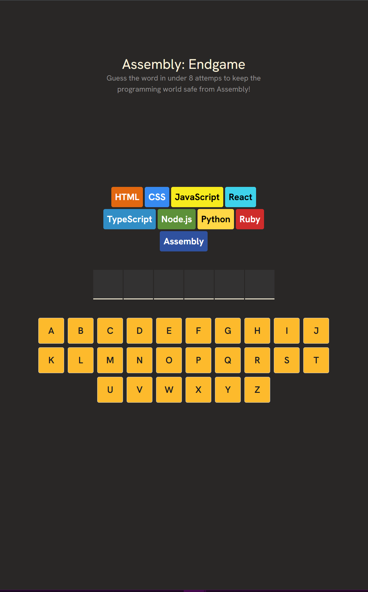
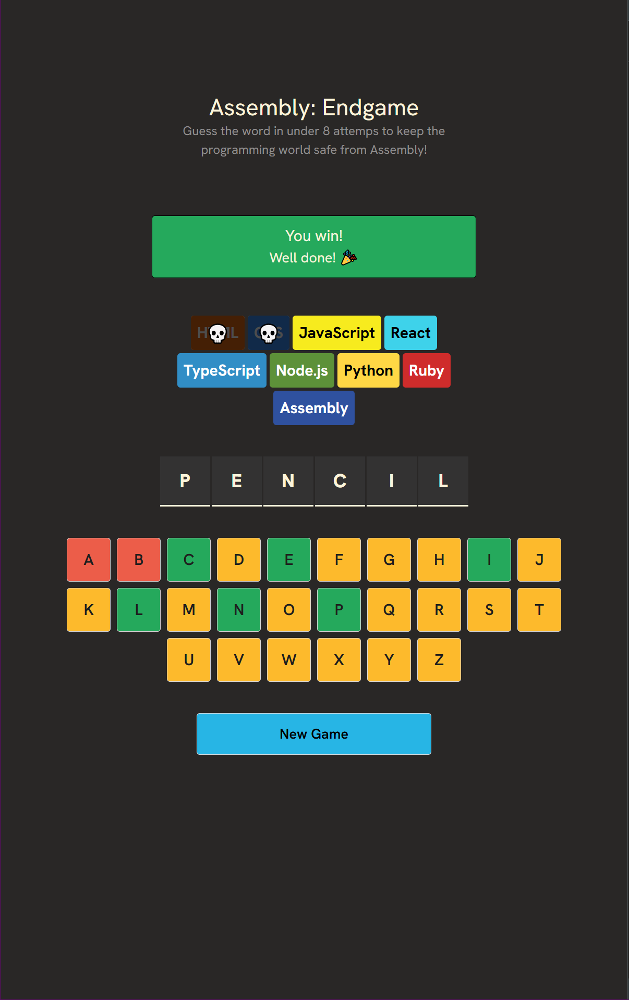
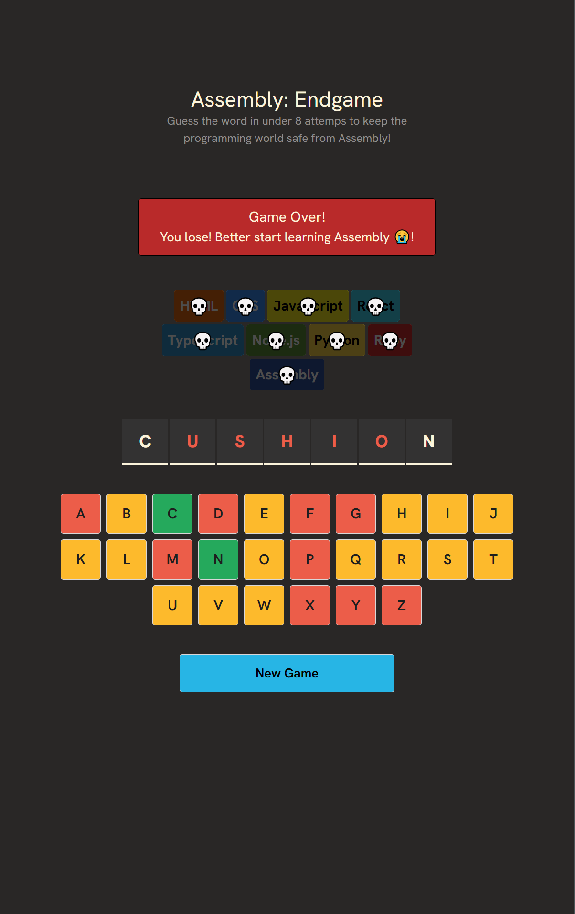

# Assembly: Endgame 🎮

A React-based word guessing game where you must save the programming world from Assembly language domination! Guess the hidden word before all programming languages get eliminated.

## 🎯 Game Overview

Assembly: Endgame is a Hangman-style word guessing game with a programming twist. Instead of drawing a hangman, each incorrect guess eliminates a programming language from existence. Your mission: guess the word in under 8 attempts to keep the programming world diverse and safe!

## 📸 Screenshots

### Main Game Interface


### Victory Screen


### Game Over Screen


## 🚀 Features

- **Interactive Word Guessing**: Click letters to guess the hidden word
- **Programming Language Theme**: 9 different programming languages at stake
- **Visual Feedback**: Letters change color based on correct/incorrect guesses
- **Dynamic Notifications**: Witty farewell messages for eliminated languages
- **Responsive Design**: Modern UI built with Tailwind CSS
- **TypeScript Support**: Full type safety throughout the application

## 🛠️ Tech Stack

- **React 19.1.0** - Frontend framework
- **TypeScript** - Type safety and better development experience
- **Vite** - Fast build tool and development server
- **Tailwind CSS 4.1.7** - Utility-first CSS framework
- **Custom Fonts** - Google Fonts integration (Hanken Grotesk, Inter, Poppins, etc.)

## 📦 Installation

1. **Clone the repository**
   ```bash
   git clone <repository-url>
   cd assembly-endgame
   ```

2. **Install dependencies**
   ```bash
   npm install
   ```

3. **Start development server**
   ```bash
   npm run dev
   ```

4. **Build for production**
   ```bash
   npm run build
   ```

5. **Preview production build**
   ```bash
   npm run preview
   ```

## 🎮 How to Play

1. **Start the Game**: A random word is selected and displayed as blank spaces
2. **Make Guesses**: Click on alphabet letters to guess
3. **Track Progress**: 
   - Green letters are correct and in the word
   - Red letters are incorrect
   - Yellow letters haven't been guessed yet
4. **Watch the Stakes**: Each wrong guess eliminates a programming language
5. **Win Condition**: Reveal all letters before 8 incorrect guesses
6. **Lose Condition**: Make 8 incorrect guesses and Assembly takes over!

## 🏗️ Project Structure

```
src/
├── components/
│   ├── inputs/
│   │   ├── Letters.tsx          # Individual letter buttons
│   │   └── NewGameButton.tsx    # Reset game functionality
│   ├── Eliminations.tsx         # Programming languages display
│   ├── GuessWord.tsx           # Word display with blanks
│   ├── Keyboard.tsx            # Virtual keyboard layout
│   ├── NotificationBanner.tsx  # Game state messages
│   └── Title.tsx               # Game header and title
├── types/
│   ├── farewellText.ts         # Farewell message types
│   ├── game.ts                 # Game state interfaces
│   └── languages.ts            # Programming language types
├── utils/
│   ├── alphabets.ts            # A-Z letter array
│   ├── farewellText.ts         # Random farewell messages
│   ├── languages.ts            # Programming languages data
│   ├── randomWordGenerator.ts  # Word selection logic
│   └── words.ts                # Word database
├── App.tsx                     # Main application component
├── main.tsx                    # Application entry point
└── index.css                   # Global styles and fonts
```

## 🔧 Available Scripts

- `npm run dev` - Start development server
- `npm run build` - Build for production
- `npm run lint` - Run ESLint
- `npm run preview` - Preview production build

## 📝 Game Logic

### Word Selection
- Random word chosen from a curated list of 400+ English words
- Words are converted to uppercase for display
- Each letter tracks visibility and color state

### Game State Management
- **keyPressed**: Array of guessed letters
- **incorrectGuesses**: Counter for wrong attempts
- **gameState**: Tracks win/loss status
- **pogLang**: Currently eliminated programming language

### Win/Loss Conditions
- **Win**: All letters in the word are revealed
- **Loss**: 8 incorrect guesses made (all languages eliminated)

## 📄 License

This project is open source and available under the [MIT License](LICENSE).


**Save the programming world, one word at a time!** 🌍💻